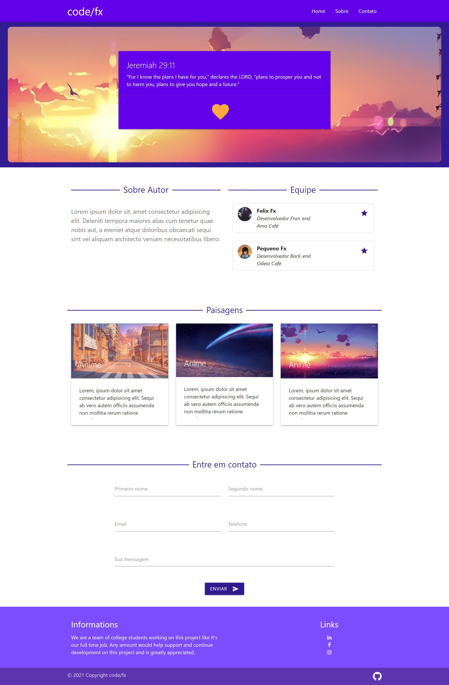
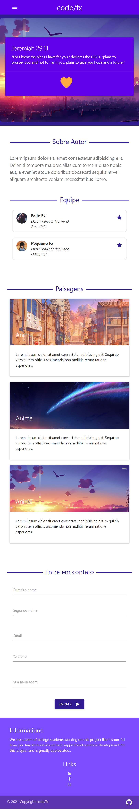

# Landing Page Planos

Landing page como foco principal em venda de assinatura ou planos

## 🚀 Landing Page

## 🛠️ Construído com

## ✒️ Autores

* **Dev** - *Trabalho Inicial e final* - [pequenofx](https://github.com/pequenofx)

## 📄 Licença

©Todos os direitos reservados 

## 🎁 Considerações finais

* aperfeiçoando minhas skills usando o framework materializer 
* Aprendi muito com esse projeto, sempre buscando evolução cada dia mais 📢

---
⌨️ com ❤️ por [pequenofx](https://gist.github.com/pequenofx) 😊
